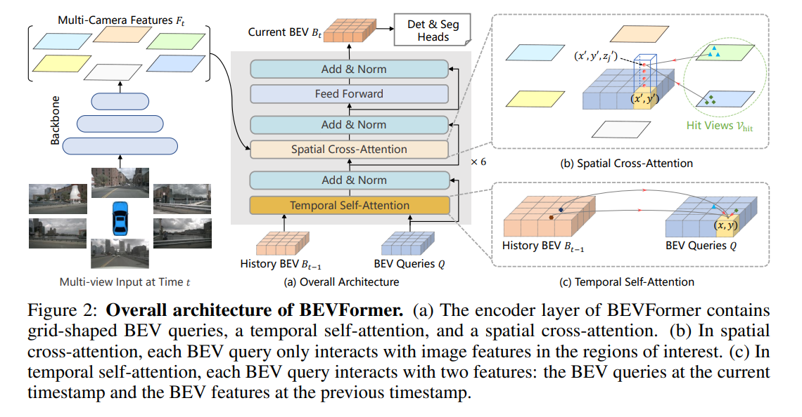
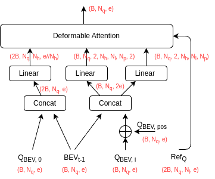

# BEVFormer

Ref: [github](https://github.com/fundamentalvision/BEVFormer)

BEVFormer is a method to fuse multi-camera images to obtain current BEV feature. The current BEV feature can then be used for detection/segmentation tasks.

The architecture from the original paper is shown here, which is hard to understand for a reimplementation, as many details are missed.

## 1. Reorganize the architecture

### 1.1 Encoder

The encoder takes the following inputs
- multi-camera multi-level image features as (K, V): a tuple of num_levels. Each element has shape (batch_size, num_camera, feat_h, feat_w, feat_dim), or 
  $(B, N_{cam}, h_{feat}, w_{feat}, d_{feat})$
- history BEV feature $BEV_{t-1}$. Shape: $(B, N_q, e)$. $N_q$ is the length of BEV feature map of shape $(h_{bev}, w_{bev})$.
- BEV query $Q_{BEV}$. Shape: $(B, N_q, e)$. Same shape as BEV feature.

After temporal self-attention and spatial cross attention in each layer, the encoder output current fused BEV feature $BEV_t$.

#### 1.1.1 Encode Layer

##### 1.1.1.1 Temporal Self-Attention
The detailed calculation of the temporal self-attention is illustrated as follows. 
The bottome mechanism is deformable attention, where the query attends to sampling points in the (K,V) map.

The notions are:
- $B$: batch size
- $N_q$: query length. In self-attention, it is the length of flattened BEV feature map of shape (h, w)
- $e$: model/embedding dimension
- $2B$: due to the concatenation of $(BEV_{t-1}, Q_{BEV, 0})$
- $N_h$: number of heads, e.g., 8
- $N_l$: number of image feature levels from the backbone, e.g., 4
- $N_p$: number of neighbor points to be sampled for each reference point, e.g., 8
 

##### 1.1.1.2 Spatial Cross-Attention

The notations are:
- $N_c$: number of cameras
- $N_f$: length of flattend feature map at all levels for each image
- $N_z$: number of neighborhood points sampled at z-axis of a BEV pillar, e.g., 4. It should be smaller than $N_p$  
- $l$: number of query points hit on 2-D cameras after projection
   
## 2. Detection/Segmentation Head

The detection head is a DETR transformer decoder, which takes the encoder outputs (e.g., BEV feature from cameras) and object queries. 
More details can be refered to original DETR paper.